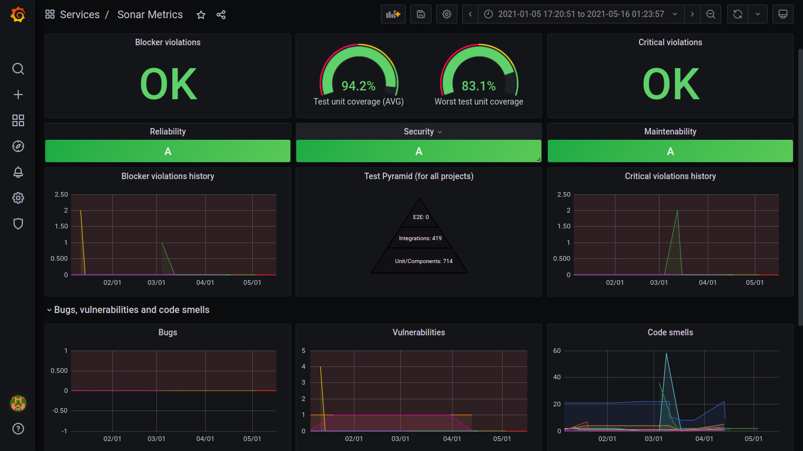
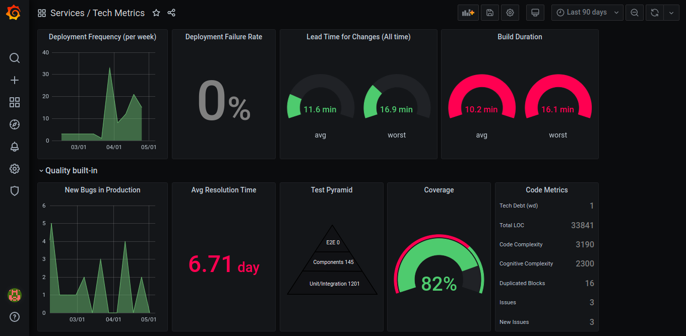
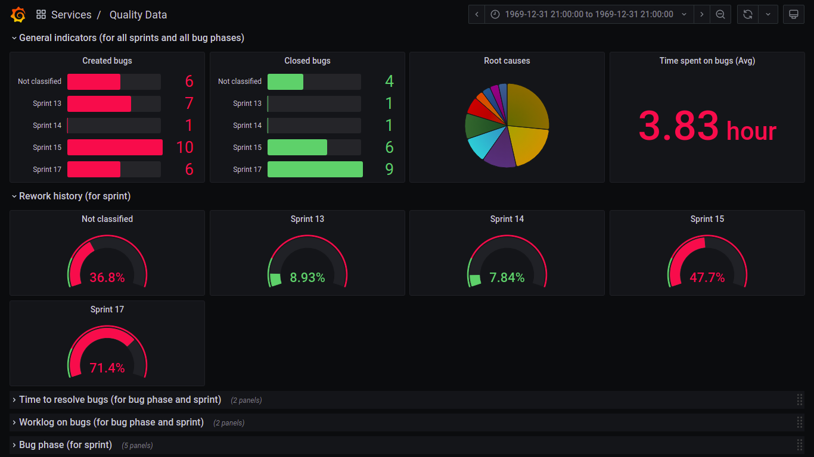

# Get Ultimate Reports Updated (G.U.R.U) Dashboard for Teams

 



## Overview
Stack responsible for providing technical and operational metrics to be visualized in grafana.


#### Componentes:
- Grafana: Responsible for dashboards, the ./grafana folder has all the configuration of datasources and dashboards to upload via docker.
- Influxdb: Timeseries database for metrics, is rising via docker with no mapped volume, so when the container dies the records are reset.
- Strapi: CMS for configurations, today we have two collections, datasources and custom-metrics.
- metrics-service: Service in nodeJS, responsible for reading the configurations of the strapi, and accessing the different datasources to obtain metrics, process them and insert in influxdb, in a recurring way according to the CRON configuration in the docker-compose.

## Requirements
- Docker
- Docker Compose
- Node 12+: just for development.

## Instructions

1 - Run
```
docker-compose up
```

2 - Then it is necessary to configure datasources for application via strapi, through: http://localhost: 1337

Default access:
user: admin@techmetrics.ciandt
pass: techmetrics

3 - That done, just access the grafana at http://localhost:3000 with username and password "admin".

## Datasources
Datasources are implementations of external providers, who must make the data available through Rest APIs, currently the following providers are available:

#### Jira

[JIRA DOCS](docs/jira.md)

#### Azure

[AZURE DOCS](docs/azure.md)

#### Sonar

[SONAR DOCS](docs/sonar.md)

#### Strapi

[STRAPI DOCS](docs/strapi.md)

### New Custom Providers
New providers can be implemented, for jenkins, GOCD, among other possibilities, for that it is necessary:

Create a new provider in:
```
./metrics-service/src/providers/provider_name
```
Follow sonar.provider as an example.

Then it is necessary to add it to the Record of provider.factory:
```
const providers: Record<string, ProviderFunction> = {
  azure: getAzureMetrics,
  sonar: getSonarMetrics,
  strapi: getStrapiMetrics,
  new_provider: getNewProviderMetrics(),
};
```

That done, it is enough that a new datasource is registered pointing to this provider within the strapi.